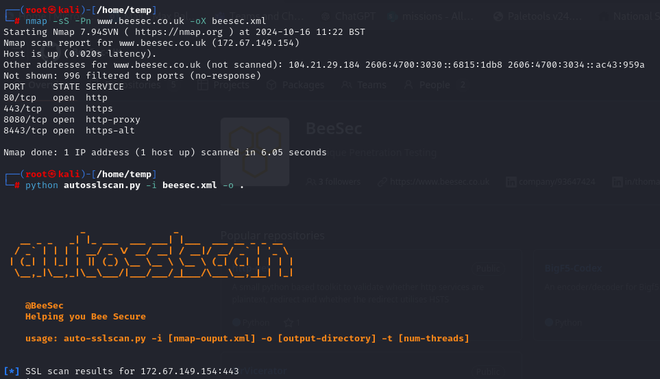
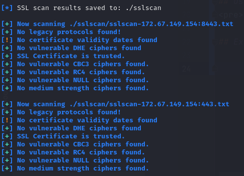

# Auto-SSLScan

Auto-SSLScan is a Python script designed to automate SSL scanning for open ports found in an Nmap XML report. The script identifies SSL services, runs `sslscan` against the discovered services, and analyzes the scan results to detect potential vulnerabilities like weak ciphers and legacy protocols.

## Features

- Automatically scans SSL-enabled services discovered by Nmap.
- Identifies weak ciphers and legacy protocols (SSLv2, SSLv3, TLSv1.0, TLSv1.1).
- Checks for vulnerable DHE ciphers (≤ 1024 bits).
- Extracts SSL certificate expiration dates and checks for certificate status (expired, expiring soon, long expiry).
- Detects untrusted SSL certificates.
- Filters out weak ciphers such as CBC3, RC4, and NULL ciphers.
- Scans using multiple threads to speed up the process.

## Prerequisites

- **sslscan** should be installed and available in your system's PATH.

## Usage
<pre>auto-sslscan.py -i [nmap-output.xml] -o [output-directory] -t [num-threads]</pre>

## Examples
Setup:

Results:

